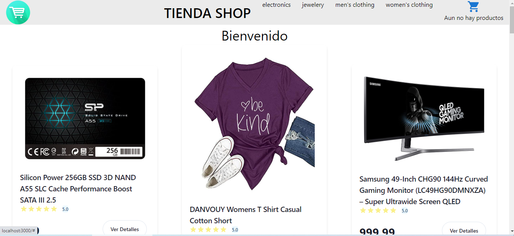
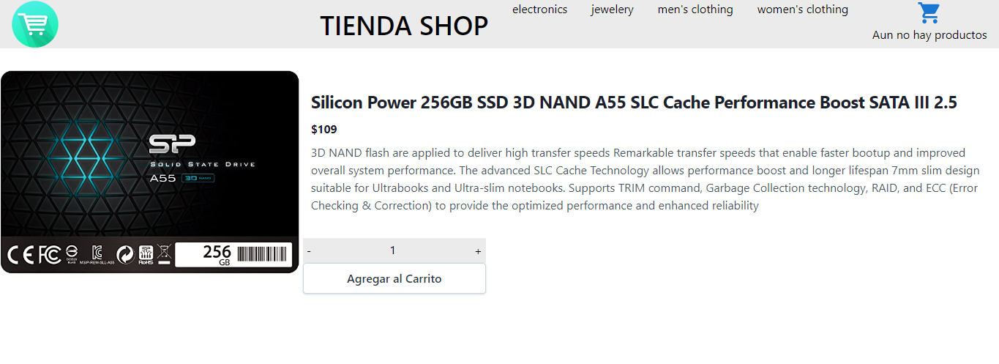
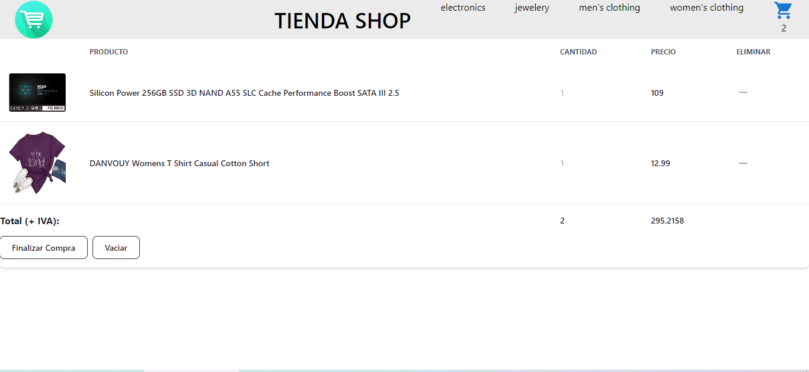

# Tienda Shop 

*Es una sitio que simula una e-commerce, desarrollada en React Js.*
#### Se construyó usando [Fake Store](https://fakestoreapi.com/)

## IMAGENES

## CARACTERISTICAS

- Consume principalmente la FakeStore Api para obtener listado y detalles de productos.

- Filtrado por categorías de items.
- Obtencion de datos desde base de datos (Firebase)

## HERRAMIENTAS UTILZIADAS

- React Js
- CSS
- Tailwind
- FireBase
- Fake Store API

# ¿COMO LO PRUEBO?

- ### Clona el repositorio  

- ### Desde la terminal, situado en la carpeta de proyecto 
    - ejecutar el comando npm i

- ### Por ultimo ejecutar lo siguiente
    - $ npm start

### Como resultado se iniciara la exposicion en tu navegador. A disfrutarlo!